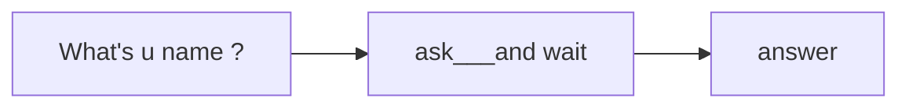
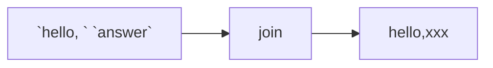
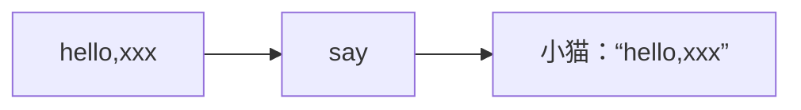

# 伪代码：

```
1    Pick up phone book
2    Open to middle of phone book
3    Look at page
4    If person is on page
5        Call person
6    Else if person is earlier in book
7        Open to middle of left half of book
8        Go back to line 3
9    Else if person is later in book
10        Open to middle of right half of book
11        Go back to line 3
12    Else
13        Quit
```


- 类似于`Pick up`、`Open to`、`Look at`、`Call`、 `Quit`。这些`动词、动作`，我们称之为函数
  （计算机能帮你完成的一些小任务）。
- 类似于`If`、`Else if`、`Else`。这样的条件语句结构，是道路的分叉口，根据一个问题来决定走哪条路。
- 类似于`person is on page`、`person is earlier in book`、`person is later in book`。这类提出的问题，称之为布尔表达式。  
  布尔表达式是一种答案只有`是`或`否`、`真`或`假`、`黑`或`白`、`1`或`0`的问题，只有两种可能性，含有二进制的意思。  
  布尔表达式会给出是或否的答案，让你知道你该往哪个方向走。
  缩进因此变得很重要。
- 类似于`Go back to`。回到某一行，形成了一种循环。
---


> [!TIP]
> 橡皮鸭调试法：  
> 向桌上的橡皮鸭提问，开口描述问题，有条理地说明自己想实现什么、实际在做什么、错误到底是什么，理清自己的困惑所在。


# Scratch
地址：`scratch.mit.edu`  


## Scratch中的input、algorithm、output










类似数学运算，先算括号内，再算括号外。


## 文字转语音


## 循环


## 自定义函数


## 永久循环


